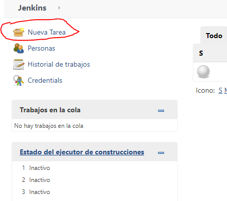
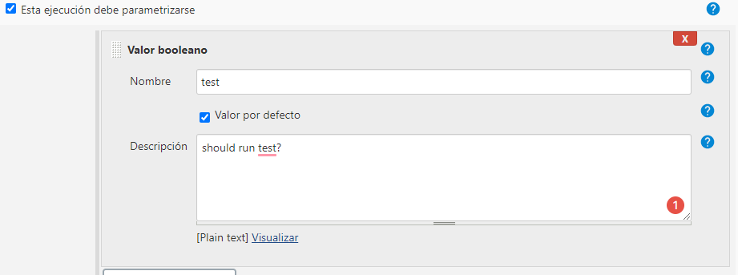

# Basic Training for DevOps
Este repositorio contiene el codigo base para automatizar el testing de un programa utilizando jenkins

### Resultados esperedos:
- Correr pruebas unitarias en pytest de manera automatica con jenkins
- Realizar un analysis estatico del codigo utilizando SonarQube

### 1. Crear un jenkins job
En jenkins podemos automatizar nuestro proceso de desarrollo utilizando jobs. Cada jobs consiste en un set de pasos 
que ejecutara el servidor, esto se puede utilizar para realizar testing cada que se genera un cambio en un rama, para garantizar la estabilidad del software antes de hacer un deployment e incluso realizar un deployment de manera automatica.

Para realizar un  jenkins job debemos crear un archivo llamado **jenkinsfile**
En este jenkins file especificaremos en que nodo debe correr nuestro job en este caso es el nodo **principal**.
~~~
//tell jenkins this is a pipeline
pipeline {

    //Determine in which node will the pipeline be executed
    node("principal") {
     
    }
}
~~~

Los jobs se dividen en stages cada stage es un paso secuencial en nuestro job. Definiremos 3 stages para automatizar el testing de nuestro codigo en python.

Instalamos las dependencias de nuestro proyecto
~~~
                stage('before') {
                steps {
                    sh 'python3 --version'
                    sh 'pip3 install -r requirements.txt'
                }
            }
~~~

Ejecutamos 
~~~
//add build step on tox
            stage('build') {
                steps {
                    sh 'python3 -m tox -e build'
                }
            }
~~~

Ejecutamos los tests a nuestro programa, este stage se puede controlar mediante parametros
~~~
stage('test') {
                when{
                    //only execute tests is test parameter is true
                    expression { params.test == true }
                }
                steps {
                    sh 'python3 -m tox -e test'
                }
            }
~~~

El jenkins file resultante es el siguiente
~~~
pipeline {
    //execute in specific docker container
    //agent { docker { image 'python:3.7.2' } }
    //execute in any available agent
    agent any
    //Determine in which node will the pipeline be executed

    stages {
            stage('before') {
                steps {
                    sh 'python3 --version'
                    sh 'pip3 install -r requirements.txt'
                }
            }
            //add build step on tox
            stage('build') {
                steps {
                    sh 'python3 -m tox -e build'
                }
            }
            stage('test') {
                when{
                    //only execute tests is test parameter is true
                    expression { params.test == true }
                }
                steps {
                    sh 'python3 -m tox -e test'
                }
            }
        
    }
    
}
~~~

#### En la seccion general
- Visitar el sitio de [jenkins](jenknis-tec.westus.cloudapp.azure.com)
- Crea una nueva tarea de tipo  pipeline 

- El name de tu tarea sera **NombreApellido**
- Seleccion Pipeline y presiona el boton de ok

- Activa la casilla esta ejecucion debe parametrizarse
- Agrega un parametro de tipo booleano con la siguiente configuracion

- Activa la casilla de github project e inserta el url de este repositorio
~~~
https://github.com/charlie83Gs/DevOpsBasicTrainingTec
~~~
#### En la seccion Build Triggers
Estos son los eventos que pueden iniciar automaticamente nuestra tarea.
Seleccionaremos la opcion: 

Esto permitira que nuestra tarea se active al realizar un push a nuestro repositorio

#### En la seccion Pipeline
- Seleccionamos pipeline script from SCM
- Indicamos el repositorio https://github.com/charlie83Gs/DevOpsBasicTrainingTec
- En branches to build indicamos nuestra rama NombreAppellido

### 2. Analizar el codigo utilizando SonarQube
Para tomar ventaja de SonarQube en nuestro pipeline vamos a modificar el jenkins agregando un nuevo stage

~~~
stage('SonarQube analysis') {
                steps {
                    script{
                        def scannerHome = tool 'SonarScanner';
                        withSonarQubeEnv('sonar') { // If you have configured more than one global server connection, you can specify its name
                            sh "${scannerHome}/bin/sonar-scanner"
                        }
                    }
                }
            
~~~